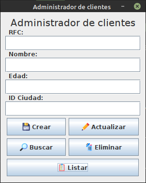

# Administrador de clientes 

Proyecto del curso Tópicos Avanzados de programación

## Objetivo
Desarrollar un simple CRUD persistiendo la información en archivos binarios.
Usar dos archivos, un índice en el que se guardara la clave primaria (RFC) y
la posición del registro con los datos del cliente en el otro archivo.

El archivo índice estará ordenado alfabeticamente y la busqueda de registro
se hará usando busqueda binaria.

## :bug: Issues
Paginar tabla de clientes

#### Guia visual de Layouts para java
https://docs.oracle.com/javase/tutorial/uiswing/layout/visual.html
